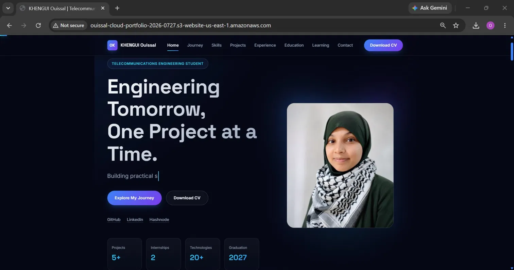
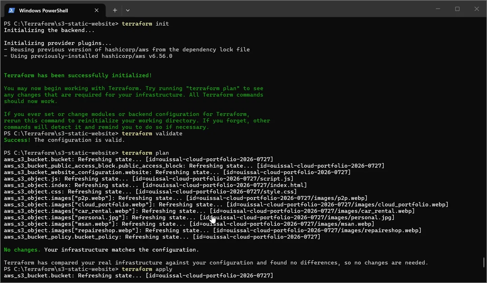
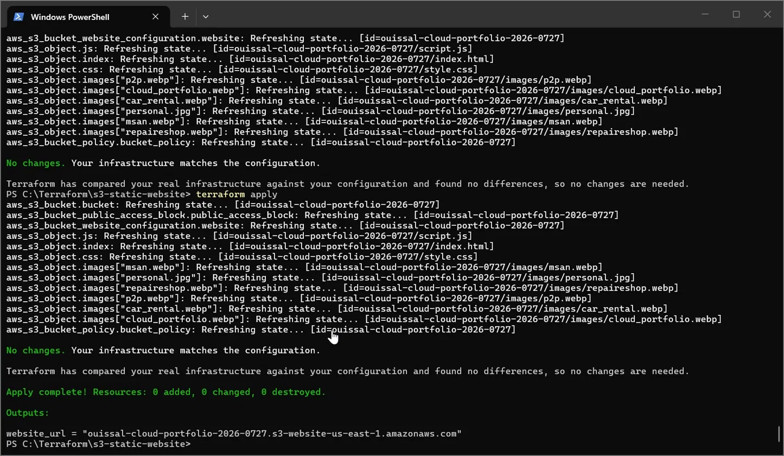
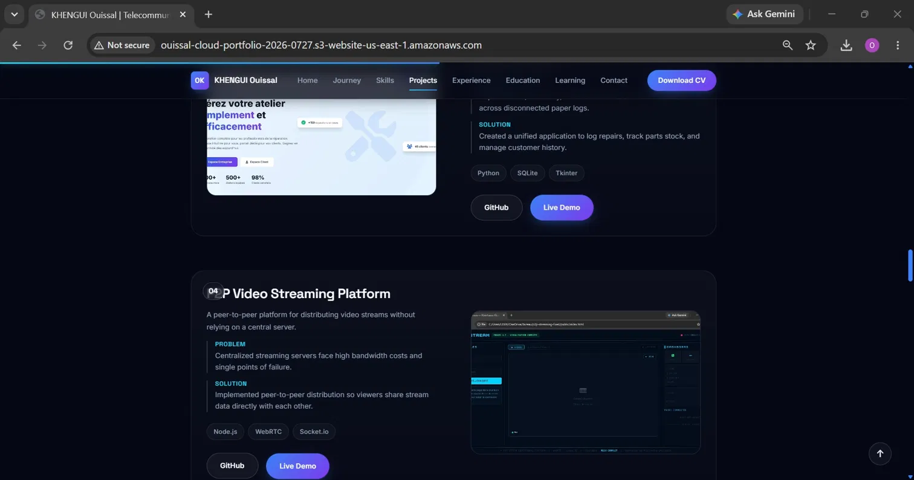
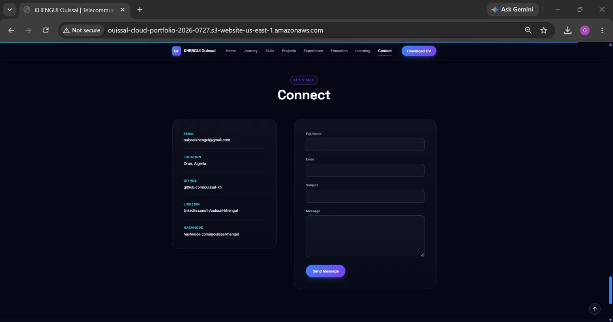

# 🌐 Personal Portfolio Website | AWS S3 & Terraform

<p align="center">


</p>

---

# 📌 About This Project

<p align="center">
  
</p>

This repository contains my personal portfolio website, showcasing my projects, technical skills, and learning journey in Cloud Computing and Cybersecurity.

The website is hosted on Amazon S3 and deployed using Terraform, demonstrating how Infrastructure as Code (IaC) can automate cloud resource provisioning.

---

## ✨ Features

- Responsive design for desktop and mobile devices
- About Me section
- Technical Skills section
- Projects showcase
- Contact information
- Static website hosting on Amazon S3
- Infrastructure managed with Terraform

---

# 🏗 Deployment Architecture

Local Website Files
        │
        ▼
Terraform Configuration
        │
        ▼
Amazon S3 Bucket
        │
        ▼
Static Website Hosting
        │
        ▼
Portfolio Website

---


# 🚀 Technologies Used

- HTML5
- CSS3
- JavaScript
- Terraform
- Amazon Web Services (AWS)
- Amazon S3
- Git
- GitHub
- Markdown

---

# 📂 Project Structure

```text
terraform-s3-static-website/
│
├── images/
├── screenshots/
│   ├── terraform-plan.png
│   ├── terraform-apply.png
│   ├── website-home.png
│   ├── website-projects.png
│   └── website-contact.png
│
├── index.html
├── style.css
├── script.js
├── main.tf
├── README.md
└── .gitignore
```

---

# ⚙️ Terraform Deployment

### Initialize Terraform

```bash
terraform init
```

### Validate the configuration

```bash
terraform validate
```

### Preview the deployment

```bash
terraform plan
```

### Deploy the infrastructure

```bash
terraform apply
```

---

# 📸 Project Screenshots

## Terraform Plan



---

## Terraform Apply



---

## Portfolio Home Page


---

## Projects Section



---

## Contact Section



---

# 📚 Learning Outcomes

Through this project, I learned how to:

- Build and organize a responsive portfolio website.
- Deploy a static website using Amazon S3.
- Automate cloud infrastructure with Terraform.
- Configure S3 Static Website Hosting.
- Upload website assets using Infrastructure as Code.
- Configure public access with S3 Bucket Policies.
- Manage cloud resources through Terraform.
- Use Git and GitHub for version control.

---

# 🚀 Future Improvements

- Deploy the website using Amazon CloudFront.
- Configure a custom domain with Amazon Route 53.
- Enable HTTPS using AWS Certificate Manager (ACM).
- Automate deployment with GitHub Actions.
Refactor the Terraform configuration using reusable modules.
---

# 📖 Note

This project was deployed using a temporary AWS Lab environment for learning purposes.

The live website endpoint may become unavailable after the lab session expires. However, all Terraform configuration files, website source code, and deployment steps are available in this repository.

---

# 👩‍💻 Author

**Ouissal Khengui**

Cloud Computing & Cybersecurity Student

- GitHub: https://github.com/ouissal-kh
- LinkedIn:  https://www.linkedin.com/in/ouissal-khengui-057a73260/

